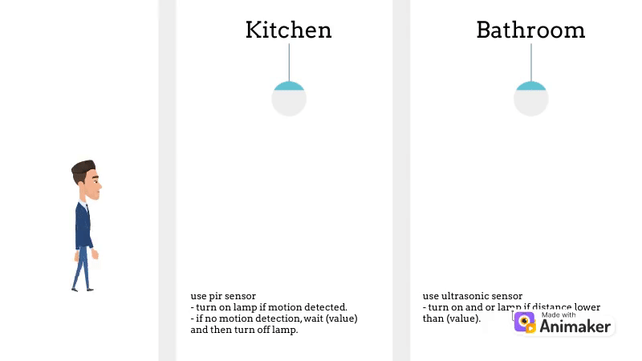

<h3 align="center">spothings</h3>

Make everything automatic and make things easier.

---

## About Project
This project offers a convenient solution for controlling lights or devices in the kitchen and bathroom areas using ultrasonic and passive infrared (PIR) sensors. With this setup, users can effortlessly turn lights or appliances on and off without physical contact, enhancing convenience and energy efficiency. The combination of ultrasonic and PIR sensors ensures reliable detection of movement and proximity, providing seamless operation in various scenarios. This project aims to simplify everyday tasks and improve user experience in household settings.

### Simulation

wokwi.com: https://wokwi.com/projects/377214972432386049

### Development
- This project using Arduino Nano board.
- Copy `config.h.example` to `config.h` and set the value.
- Build and run using VSCode or Arduino IDE.

## Copyright
This project is owned by [spothings](https://github.com/spothings/spothings). Copyright, Privacy Policy and License are sourced from there.

### Donation
If you think this project is helpful, you can make a donation. For those of you who want to make a donation, we would really appreciate it. Donations can be made through [Buy Me a Coffee](https://www.buymeacoffee.com/bukanspot) or [PayPal](https://paypal.me/bukanspot).

### Contributor
